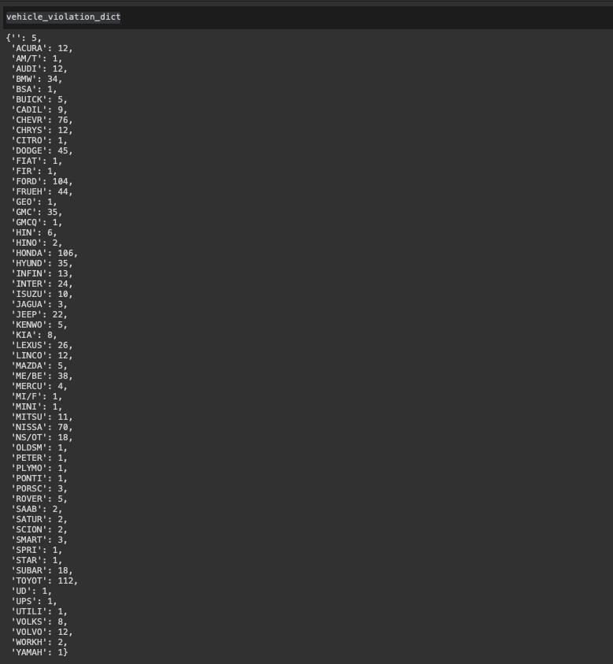

# Assignment 13

### This is submitted as part of Assignment 13 for EPAi3 Course.


## Table of Contents

  - [Goals](#goal)
  - [Approach](#approach)
  - [Results](#results)


## 1. Goals

 ## <b>i. Create a lazy iterator that will return a named tuple of the data in each row. The data types should be appropriate - i.e. if the column is a date, you should be storing dates in the named tuple, if the field is an integer, then it should be stored as an integer, etc.</b>

 ## <b>ii. Calculate the number of violations by car make.</b>

Note: Try to use lazy evaluation as much as possible - it may not always be possible though! That's OK, as long as it's kept to a minimum.
    
 
## 2. Approach
Goal 1
```python
def read_file(path):
    with open(path) as f:
        for i,j in enumerate(f):
            if i == 0:
                continue            
            li = j.strip("\n").split(",")
            li[4] = datetime.strptime(li[4], '%m/%d/%Y').date()
            li[5] = int(li[5])
            
            try:
                yield car_tuple(*li)
            except:
                pass
```
Goal2

```python
for i in car_tuples:
    brand = i.Vehicle_Make
    if brand not in vehicle_violation_dict:
        vehicle_violation_dict[brand] = 0
    vehicle_violation_dict[brand] += 1
```

## 3. Results 

  <p align="center">
    

  </p>
